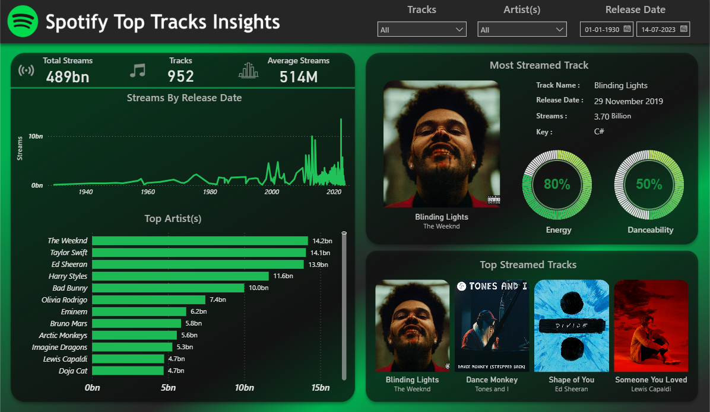

# 🎵 Spotify Top Tracks Insights  

An end-to-end data analysis project exploring **top Spotify tracks from 1930–2023**, focusing on streams, artists, track popularity, and song attributes.  
The project leverages **Google BigQuery for data sourcing** and **Power BI for interactive dashboards**, delivering insights for music analysts, playlist curators, and marketing teams.  

---

### Data Preparation & Cleaning  

Data was linked from **Google BigQuery** into Power BI, and necessary transformations were applied in **Power Query**:

- **Streams column:** Removed rows with errors (<1% of data).  
- **Key column:** 10% null values replaced with `'None'`.  
- **in_shazam_charts column:** 5% null numerical values replaced with `0`.  
- **Date columns:** Combined year, month, and day into a single **date** column.  
- **Data model:** Created a separate **Date table** and connected it with the main dataset for time-based analysis.  

**Insights from Data Prep:**  
- ✅ Data is clean and ready for analytics.  
- ⚠️ Minor null or error rows will not significantly affect trends or aggregations.  

---
## 📊 Dashboards  
  

**Key Metrics Cards**  
- **Total Streams:** 489bn  
- **Tracks Analyzed:** 952  
- **Average Streams per Track:** 514M  

**Slicers Added:**  
- Tracks → select/search by track name  
- Artist(s) → select/search by artist name  
- Date Released → filter between dates  

**Insights:**  
- ✅ A few tracks contribute disproportionately to total streams.  
- ⚠️ Average streams indicate strong skew, highlighting the top performers.  

**Recommendation:**  
- 🚀 Focus playlist and promotional campaigns on top tracks.  
- 🔍 Analyze mid-performing tracks for potential growth opportunities.  

---

### Streams by Release Date (Line Chart)  

**Insights:**  
- 📈 Pre-2000 tracks had consistently low streams.  
- 🔹 Streams started spiking post-2000, showing the impact of digital music adoption.  
- ⬆️ Post-2012, streams fluctuated but trended upward, particularly high after 2021.  
- Indicates **recent tracks dominate streaming popularity**.  

**Recommendation:**  
- 🕒 Prioritize recent releases in playlists and marketing campaigns.  
- 🎵 Consider “classic hits” playlists for older tracks to maintain diversity.  

---

### Top Artists (Bar Chart)  

**Insights:**  
- **The Weekend:** 14.2bn streams  
- **Taylor Swift:** 14.1bn streams  
- **Ed Sheeran:** 13.9bn streams  
- Top artists dominate streaming performance.  

**Recommendation:**  
- 🎯 Focus marketing campaigns and playlists around top artists.  
- 🔍 Track emerging artists for trend spotting.  

---

### Most Streamed Track Section  

**Visuals:**  
- **Track:** Blinding Lights  
- **Artist:** The Weekend  
- **Energy% Arc Chart:** 80%  
- **Danceability% Arc Chart:** 50%  

**Insights:**  
- High energy suggests strong tempo and rhythm, suitable for workout/party playlists.  
- Moderate danceability indicates versatility and wide appeal.  

**Recommendation:**  
- 🎵 Use top tracks like this in high-engagement playlists.  
- 📊 Analyze track attributes to inform curation of new hits.  

---

### Top Streamed Tracks Section  

**Visuals:** Top 4 tracks with cover images, track names, and artists:  
1. Blinding Lights – The Weekend  
2. Dance Monkey – Tones and I  
3. Shape Of You – Ed Sheeran  
4. Someone You Loved – Lewis Capaldi  

**Insights:**  
- Tracks show **high engagement** and global popularity.  
- Visual comparison highlights fan favorites at a glance.  

**Recommendation:**  
- 📌 Include these tracks in promotional playlists.  
- 🔍 Study common characteristics to predict potential hits.  

---

### Dashboard Insights & Recommendations  

**Insights:**  
- Streaming is dominated by **recent releases**, especially post-2012.  
- Few tracks and artists contribute the majority of streams.  
- Song attributes like **energy and danceability** are critical for playlist segmentation.  

**Recommendations:**  
1. **Playlist Strategy:** Highlight high-energy, high-stream tracks for engagement.  
2. **Artist Promotion:** Focus campaigns on top artists.  
3. **Content Development:** Analyze top track attributes to inform future releases.  
4. **Historical Trends:** Include “classic hits” playlists to maintain diversity.  

---

## 🛠 Tech Stack  
- **Google BigQuery** → Data source and querying  
- **Power BI** → Dashboard creation & visualization  
- **Excel/CSV** → Intermediate data handling  

---

## 👨‍💻 Created By  

**Aditya Raj**  
> B.Tech CSE | Bennett University  
> Data Analytics & AI Enthusiast  

- 📧 Email: [aditya.work0902@gmail.com](mailto:aditya.work0902@gmail.com)  
- 💻 GitHub: [@Aditya-0009](https://github.com/Aditya-0009)  
- 👔 LinkedIn: [Aditya Raj](https://www.linkedin.com/in/aditya-raj-0009/)  
- 📸 Instagram: [@ig._adi_](https://www.instagram.com/ig._adi_/)
